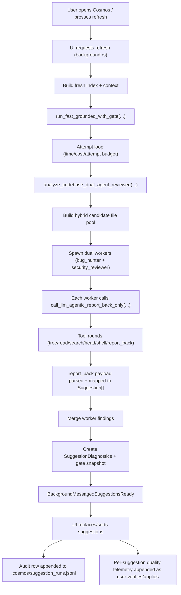

# Suggestions Observability

This document describes the end-to-end Suggestions pipeline and how to inspect it.

## End-to-end flow



## What is now visible

- Run-level diagnostics in audit mode:
  - `cosmos --suggest-audit --suggest-runs 1 --suggest-trace`
- Live reasoning stream in audit mode:
  - `cosmos --suggest-audit --suggest-runs 1 --suggest-trace --suggest-stream-reasoning`
- Persistent run snapshots:
  - `.cosmos/suggestion_runs.jsonl`
- Per-worker trace notes (stored in diagnostics notes):
  - iterations, tool call count, report_back iteration
  - assistant/reasoning preview snippets (truncated)

## Reasoning visibility

By default, reasoning output is excluded from provider responses.

- Default: reasoning hidden (`include_reasoning=false`)
- Opt-in: set `COSMOS_INCLUDE_REASONING=1`
- Live stream opt-in: set `COSMOS_STREAM_REASONING=1` (or use `--suggest-stream-reasoning`)

Example:

```bash
COSMOS_INCLUDE_REASONING=1 cosmos --suggest-audit --suggest-runs 1 --suggest-trace
COSMOS_STREAM_REASONING=1 COSMOS_INCLUDE_REASONING=1 cosmos --suggest-audit --suggest-runs 1 --suggest-trace
```

Important limitation:
- You can only see provider-returned rationale fields.
- Hidden internal chain-of-thought is not exposed by the API.
